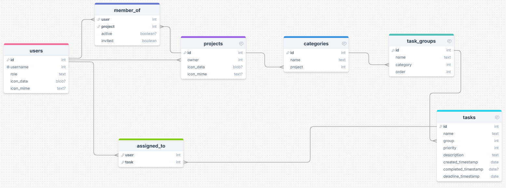

# Sprint 1 - A Working UI Prototype

## Sprint Goals

Develop a prototype that simulates the key functionality of the system, then test and refine it so that it can serve as the model for the next phase of development in Sprint 2.

[Figma](https://www.figma.com/) is used to develop the prototype.

---

## Initial Database Design

This is the initial design for my website, and is already fairly complex, so I will probably not be able to implement many feature additions my end users may request. In this design, users can create projects which contain categories of task groups. Categories are intended to refer to a specific area of game development, such as art or programming, while task groups are used for additional organisation users may desire. Task groups hold tasks, which may have users assigned to them. The owner of a project can also invite other users to that project through the member_of table, which doubles as an invitation system. Users will be admins of projects if they are the owner of that project, and a member_of entry will not be made for the owner.

### Required Data Input

Users:
- Username and password will be obtained through the sign up page.
- Avatar image and role can be provided later from the user's profile page.

Projects:
- A user can create their own project from their projects page, which replaces the home page when you are signed in.
- Here, the project name and icon will be uploaded, and these will not be changeable later.

Invitations:
- A project owner can send an invite to another user by passing the other user's username into the invite form.
- A user can see and manage invitations from their projects page.
- Invitations can be accepted or declined by the user, which will change the active status. Active will be null by default, meaning the invite has not be accepted or declined. Accepting will set active to true and the user will become a member of that project. Declining will set active to false, and will hide the invitation unless the user presses the 'Show Hidden Invitations' button.

Categories:
- If a project owner wants to add their own categories from the defaults, they will have the option to from the categories panel on the left of the project page.
- Categories only need a name to be provided.

Task Groups:
- Task groups can be created by any member by pressing the + button to the right of the last task group on a project page.
- Again, only the name needs to be input.
- You will be able to change the order of a task group by pressing the left or right arrows on the task groups header.

Tasks:
- Tasks will be created with a + button in the corner.
- The user will choose which task group to assign the task to.
- The task requires a name to be set, and a deadline may be chosen if wanted.
- On the task page, you can edit the description (handled through javascript) and assign users to the task through a modal form

### Required Data Output

Invitations:
- Invitations will be displayed at the top of the projects page. This will show the project's icon, name, owner, and possibly member count.
- Hidden invitations will not show unless the user activates a checkbox. These will show the same types of data.

Projects:
- Projects are listed on the projects page, and need to display the icon, name, owner, and icon if you are the owner, and possibly member count.
- A project will list categories vertically ordered alphabetically on the left panel, and the currently select category on the right.
- The centre of the nav menu will be a breadcrumb trail that shows you project > category > task.
- Categories will list horizontally the task groups in the order given in the database, displaying their name.
- On project page, tasks will display their name, completion status (completed tasks go to an expandable section at the bottom of the list).

### Required Data Processing

Passwords will need to be encrypted with Flask's provided library for this. The password's hash will be stored in the database.

Images for user and project icons will need to be processed by resizing them to some fixed resolution using the Pillow library. The format will also be standardised as PNG because of this, so it may be acceptable to drop the image_mime fields from the database.

---

## UI 'Flow'

The first stage of prototyping was to explore how the UI might 'flow' between states, based on the required functionality.

This Figma demo shows the initial design for the UI 'flow':

<iframe style="border: 1px solid rgba(0, 0, 0, 0.1);" width="800" height="450" src="https://embed.figma.com/proto/ohwO0llpl7a2nQXxnQp42v/TaskForge-UX-MVP?node-id=2-10&p=f&scaling=scale-down&content-scaling=fixed&page-id=0%3A1&starting-point-node-id=2%3A6&embed-host=share" allowfullscreen></iframe>

### Testing

Replace this text with notes about what you did to test the UI flow and the outcome of the testing.

### Changes / Improvements

Replace this text with notes any improvements you made as a result of the testing.

*IMPROVED FIGMA FLOW - PLACE THE FIGMA EMBED CODE HERE - MAKE SURE IT IS SET SO THAT EVERYONE CAN ACCESS IT*

---

## Initial UI Prototype

The next stage of prototyping was to develop the layout for each screen of the UI.

This Figma demo shows the initial layout design for the UI:

*FIGMA PROTOTYPE - PLACE THE FIGMA EMBED CODE HERE - MAKE SURE IT IS SET SO THAT EVERYONE CAN ACCESS IT*

### Testing

Replace this text with notes about what you did to test the UI flow and the outcome of the testing.

### Changes / Improvements

Replace this text with notes any improvements you made as a result of the testing.

*FIGMA IMPROVED PROTOTYPE - PLACE THE FIGMA EMBED CODE HERE - MAKE SURE IT IS SET SO THAT EVERYONE CAN ACCESS IT*

---

## Refined UI Prototype

Having established the layout of the UI screens, the prototype was refined visually, in terms of colour, fonts, etc.

This Figma demo shows the UI with refinements applied:

*FIGMA REFINED PROTOTYPE - PLACE THE FIGMA EMBED CODE HERE - MAKE SURE IT IS SET SO THAT EVERYONE CAN ACCESS IT*

### Testing

Replace this text with notes about what you did to test the UI flow and the outcome of the testing.

### Changes / Improvements

Replace this text with notes any improvements you made as a result of the testing.

*FIGMA IMPROVED REFINED PROTOTYPE - PLACE THE FIGMA EMBED CODE HERE - MAKE SURE IT IS SET SO THAT EVERYONE CAN ACCESS IT*

---

## Sprint Review

Replace this text with a statement about how the sprint has moved the project forward - key success point, any things that didn't go so well, etc.

